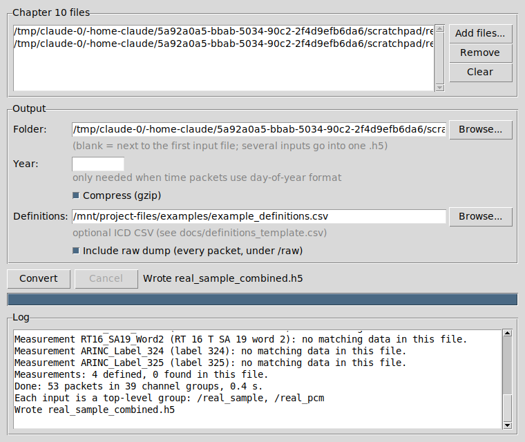

# ch10toh5

A small desktop tool that converts IRIG 106 Chapter 10 recordings (`.ch10`, `.c10`, `.tmt`) into HDF5 (`.h5`).
Measurements you define (from your ICD, or from the recording's own TMATS) are written at the top of the file as ready-to-use time and value arrays. A full dump of every packet, of every data type, sits underneath in `/raw` and can be left out.



## Install and run

You need Python 3.8 or newer with Tkinter. The python.org installers for Windows and macOS include Tkinter. On Linux, install `python3-tk`.

```
pip install -r requirements.txt
python run_gui.pyw            # opens the window (on Windows you can double-click it)
python -m ch10toh5            # same thing
python -m ch10toh5 a.ch10 b.ch10 [-o out.h5] [--defs icd.csv] [--no-raw] [--separate] [--year 2024] [--no-compress]   # command line
                              # several inputs -> one a_combined.h5 (use --separate for one .h5 each)
```

In the window, add one or more files and press **Convert**. A single file becomes `<name>.h5` next to the input. Several files go into **one** combined `.h5`: a save dialog opens with `<first file>_combined.h5` suggested, in the output folder if you set one, otherwise next to the first input.
Set **Year** only when the recording's time packets use day-of-year format and you care about the absolute date. Those packets carry no year, so the tool otherwise uses the input file's modification year.

To build a standalone Windows `.exe`, run `pip install pyinstaller`, then `pyinstaller --onefile --windowed run_gui.pyw`.

## Measurements in engineering units

Each measurement you define is a top-level group in the h5:

```
/<name>/time_ns        int64, ns since 1970-01-01 UTC, one per sample, in time order
/<name>/value          float64, engineering units   (attrs: units, description, samples,
/<name>/raw            the bit field before conversion       rate_hz_observed, sources, ...)
/<name>/<source>/...   the same three arrays for each place the data was found
/measurement_index     one row per measurement: units, sources, samples, rates, warnings
/raw/...               the full packet dump (see below); untick "Include raw dump" to leave it out
```

- **Blank channel means every channel.** A config row with no channel searches every recorder channel of that type, and the results are combined into one series. The channel column can also hold a data source name from the TMATS (`R-x\DSI`), such as `BUS-B`.
- **The same name on several rows** means the field is found in several places. All the rows are combined into one series too.
- **Duplicates are removed.** When the same data was recorded twice, for example the same bus on two channels, a sample that arrives from another source within half a sample period of one already kept is dropped. The count is in the `duplicates_removed` attribute. Every source is still kept separately under `/<name>/<source>/`: 1553 per channel and direction (`ch0002_RT5_T_SA3_W1`), ARINC-429 per channel and bus (`ch0006_bus4_L203`), PCM per channel (`ch0052_W7`).
- **Real time stamps.** Every sample keeps its own time from the recording, so the rate is whatever the data really was. Nothing is repeated or interpolated. `rate_hz_observed` gives the typical rate. If the config has a `rate` column (Hz) and the data differs from it by more than 20%, the measurement gets a `rate_warning` attribute and the log says so.

Definitions come from two places:

- **The recording's TMATS (PCM).** When the TMATS has D-group word locations (`D-x\MN`, `WP`, `WI`, `WFM`) and C-group conversions (`C-d\DCN`, `BFM`, `DCT` = COE or PTS with coefficients or pair sets, units from `MN4`), those PCM measurements are decoded automatically. The frame layout (word length, words per frame, sync pattern, bit rate) comes from the P group, linked to the channel through `R-x\TK1` and `DSI`. Subcommutated words (frame position or interval above 1) are not decoded yet. Minor frames are found by sync pattern in throughput mode, or taken from the intra-packet headers when those are on.
- **A definitions CSV** for 1553, ARINC-429 and PCM, normally built from your ICD. Choose it with **Definitions** in the window, or pass `--defs file.csv` on the command line. [`docs/definitions_template.csv`](docs/definitions_template.csv) documents every column and has one example row per case. For 1553, `word 1` is the first data word, whatever the message type: BC-to-RT, RT-to-BC and RT-to-RT messages are all handled. Messages with error flags are skipped.

The log reports rows the CSV could not use, measurements that were not found, how many sources each measurement combined, and rate mismatches. With several input files, each file gets its own `/<file>/` group with the same layout.

## The raw dump (/raw)

Everything below lives under `/raw` (and is absent if you untick **Include raw dump** or pass `--no-raw`):

```
/                      attrs: source_file, source_size, packet_count, unparsed_bytes, time_year, ...
/summary               one row per channel/data-type group: packets, messages, bytes, decode errors, path
/file_index            one row per packet in file order: offset, channel, type, length, rtc, time_ns
/TMATS/text_000        the TMATS setup record text (one dataset per TMATS packet)
/TMATS/attributes      key/value table parsed from the first TMATS record
/unparsed/regions      byte ranges that were not valid packets (corruption, truncated tail)
/unparsed/bytes        those bytes, verbatim
/channels/chCCCC_<Type>/
    packets            every packet header field, decoded CSDW fields, checksum results, time_ns
    body               every packet's data (CSDW + payload) back to back, as uint8
    messages           decoded intra-packet messages, one row each (for types that have them)
```

**Several input files in one h5:** each input gets its own top-level group named after the file, for example `/flight1/` and `/flight2/`. If two inputs have the same name, the second becomes `flight1_2`. Each group has exactly the layout described above: `/flight1/<measurement>/...`, `/flight1/raw/channels/...`, and so on. A root `/sources` table lists each group with its source file name, size and packet count. With a single input, the layout sits at the root as shown.

Each (channel ID, data type) pair gets its own group, for example `ch0002_MIL-STD-1553F1` or `ch0000_ComputerF1_TMATS`.

**No data is lost.** Every packet's raw data is stored in `body`. `packets.body_offset` and `body_length` locate each packet's data, and `messages.data_offset` and `data_length` locate each message's payload, for example the 1553 words, an Ethernet frame, a UART string or a PCM minor frame. Header fields are stored decoded. Bytes that are not part of a valid packet go into `/unparsed`. Together these account for every byte of the input, and the test suite checks that.

**Time.** `time_ns` is nanoseconds since 1970-01-01 UTC. It is computed from the file's Time F1 packets plus the 10 MHz relative time counter, or taken directly from IEEE-1588 intra-packet times. Messages that carry no time stamp of their own, such as video without intra-packet headers, get their packet's time and `ipts_format = 255`. It is `-1` where it cannot be worked out, for example when a file has no time packets.

`packets.decode_status` is 0 when the messages were decoded, 1 when the type has no message decoder (its raw data is still in `body`), and 2 when the decoder failed on that packet (its raw data is still in `body`).

### Decoded message fields by type

| Type | Decoded per message |
|---|---|
| TMATS (0x01) | text and key/value table |
| Recording events (0x02), index (0x03) | event number/count; index entries (channel, type, offset) |
| PCM F1 (0x09) | minor frames with time stamp and lock status (when intra-packet headers are on) |
| Time F1 (0x11), F2 (0x12) | year/month/day or day-of-year, h:m:s.ms, absolute time |
| MIL-STD-1553 F1 (0x19), F2 (0x1A) | block status flags, gap times, command word(s) split into RT/TR/SA/WC |
| Discrete F1 (0x29) | time stamp and 32-bit state |
| Message F0 (0x30), UART F0 (0x50) | subchannel, error flags, payload |
| ARINC-429 F0 (0x38) | bus, gap, speed, errors, label (raw and octal), SDI, data, SSM, parity |
| Video F0/F1/F2 (0x40-0x42) | 188-byte transport stream packets with time stamps |
| IEEE-1394 F1 (0x59) | status, speed, overflow flags |
| Ethernet F0 (0x68) | error flags, network ID, speed, MAC addresses, EtherType, frame |
| Ethernet F1 / ARINC-664 (0x69) | virtual link, IPs, ports, payload |
| CAN (0x78) | ID, RTR, extended flag, data bytes |
| Analog, Parallel, 1394 F0, Image, TSPI, Fibre Channel, user-defined, unknown | packet headers, CSDW fields and raw data (no per-message split) |

## Reading it back (Python example)

```python
import h5py
f = h5py.File("flight.h5")
t, v = f["Airspeed/time_ns"][:], f["Airspeed/value"][:]     # a measurement from your config

# raw 1553 words, straight from the dump
g = f["raw/channels/ch0002_MIL-STD-1553F1"]
msgs = g["messages"][:]
body = g["body"]
m = msgs[0]
words = body[m["data_offset"]: m["data_offset"] + m["data_length"]].view("<u2")  # cmd, data..., status
```

The file is standard HDF5, so MATLAB (`h5read`), HDFView and pandas can open it as well.

## Tests

```
python tests/test_roundtrip.py [real_file.ch10 ...]
python tests/test_measurements.py
```

This builds a synthetic recording covering every decoded type, plus junk bytes and a truncated packet. It checks the decoded values and confirms that the HDF5 file accounts for every byte of the input. Any real files you pass get the same byte-for-byte check.
